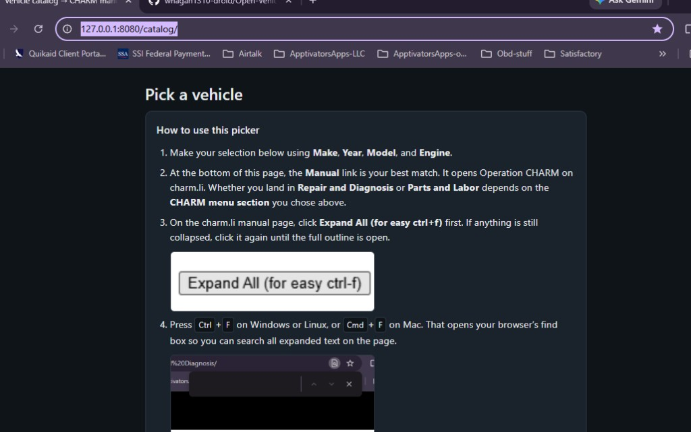

# Open Vehicle Database

**Code and scripts:** All **software** in this repository—`scripts/`, the **`catalog/`** picker, build tooling, and automation—is written and maintained by **Gam3rGoon** and **MasterTech-Pro**. **Operation CHARM** and **Xerostatic** ([**ShopBase**](https://shopbasehq.com/), **[Open Labor Project](https://openlaborproject.com/)**) **did not** author this codebase; they appear only as **inspiration**, **ecosystem context**, and (where applicable) **attributed manual sources** or links to their sites. What comes from where is spelled out in **[ATTRIBUTION.md](./ATTRIBUTION.md)**.

A community-driven, **free** automotive knowledge library—built in the spirit of **MasterTech-Pro**, **[ShopBase](https://shopbasehq.com/)**, **[Open Labor Project](https://openlaborproject.com/)**, **[Operation CHARM](https://charm.li/)**, and the broader **open repair-data** movement. Contributors are always welcome in the open realm of **equal right to repair**: *by the people, for the people*—so that repair information stays accessible instead of locked behind paywalls and gatekeeping.

**Attribution and inspirations** (CHARM, **[ShopBase](https://shopbasehq.com/)**, **[Open Labor Project](https://openlaborproject.com/)**, catalog picker notes) are summarized in **[ATTRIBUTION.md](./ATTRIBUTION.md)**. Inspiration from **[plowman/open-vehicle-db](https://github.com/plowman/open-vehicle-db)**.

---

## Why this exists

Vehicles do not last and behave as they once did. Parts, software, and diagnostics have changed dramatically over the last two decades. Along the way, much of the industry has made it harder for independent shops, mobile techs, and owners to keep what they drive on the road.

A small group of **respectable, industry-driven leaders**—with **decades of real-world experience**—decided that was enough. **We are here to stay.**

This repository is intended as a **living library** that **anyone** can use **without cost**. The goal is simple: push back on monopoly, share knowledge openly, and **grow and learn together**.

---

## Making the library usable for everyone

We have asked the same question many times: *How do we make this library useful for people who are not computer experts?*

Our answer has **two parts**:

1. **Xerostatic** — **[ShopBase](https://shopbasehq.com/)**, **[Open Labor Project](https://openlaborproject.com/)** — offers **free, web-based shop management** in the same category as tools like Mitchell1, ShopKey, and ShopMonkey, so data and workflows can live where shops already work. Learn more at [shopbasehq.com](https://shopbasehq.com/) and [openlaborproject.com](https://openlaborproject.com/). *This repo is independent from **[Open Labor Project](https://openlaborproject.com/)**’s datasets; we cite Xerostatic, **[ShopBase](https://shopbasehq.com/)**, and OLP as **inspiration** and ecosystem kinship—see [ATTRIBUTION.md](./ATTRIBUTION.md).*

2. **Gam3rGoon** — builds **custom, multi-platform applications** (Windows, macOS, Android, iOS) with add-on solutions tailored to business needs, including an **Android-based OBD2 scanner** (coming soon), so the library and related tooling can meet people on the devices they already use.

Together, the aim is for this growing library to be **something you can build on and plug into real businesses**—not just a folder of files for developers only.

---

## Related projects, attribution, and inspiration

| Resource | How we relate to it |
|----------|---------------------|
| **[ShopBase](https://shopbasehq.com/)**, **[Open Labor Project](https://openlaborproject.com/)** | **Inspiration & ecosystem alignment** — free labor, specs, DTCs, and shop tools. We **thank and credit** Xerostatic; we do **not** ship OLP data here. |
| **[Operation CHARM (charm.li)](https://charm.li/)** | **Manual content** — CHARM exports in this repo (e.g. under `Acura/`) should be **attributed** per CHARM’s terms. See [ATTRIBUTION.md](./ATTRIBUTION.md). |
| **[plowman/open-vehicle-db](https://github.com/plowman/open-vehicle-db)** | **Past inspiration** for a structured vehicle picker; **we do not redistribute their JSON.** The `catalog/` picker uses **your folder names** only. |
| **MasterTech-Pro (Gam3rGoon)** | **Values / lineage** — professional, technician-focused tooling as a guiding reference. |

---

## Vehicle catalog (CHARM picker) — Built by Gam3rGoon

The **`catalog/`** site is a **Make → Year → Model → Engine** picker. GitHub only shows this **documentation** in the README—the picker itself is **not** hosted at a github.io URL. After you **clone** the repo and **start a local web server** (see **Quick start** at the end of this catalog section), open the picker in **your** browser at:

```
http://127.0.0.1:8080/catalog/
```

*(GitHub’s README viewer may not turn `http://127.0.0.1/…` into a working link; copy the line above, or use `http://localhost:8080/catalog/`.)*

**What you see at `/catalog/`** once the server is running:

| Area | Contents |
|------|-----------|
| **Title** | *Pick a vehicle* |
| **How to use this picker** | Short steps under the title (with screenshots): expand the manual on charm.li with **Expand All (for easy ctrl+f)**, then use the browser find bar (**Ctrl+F** / **Cmd+F**). Same idea for **Repair and Diagnosis** and **Parts and Labor**. |
| **Filters** | **Make**, **Year**, **Model**, and **Engine** (labeled *from folder title* for manifest-derived rows). |
| **CHARM menu section** | Dropdown: *Vehicle menu (root)*, *Repair and Diagnosis*, or *Parts and Labor*. **Disabled** until you choose a **remote** charm.li vehicle (no local export for that make/year); it only adjusts the URL opened by the manual link. |
| **Hint** | Short line: open Operation CHARM in a **new tab** from the manual link. |
| **Manual** | Status text (e.g. *Select a make.*) and, after you narrow choices, one or more links to local `index.html` / PDF or charm.li. |
| **Footer** | *Picker Built By Gam3rGoon/MasterTech-Pro* — *Manuals:* link to [charm.li](https://charm.li/) and **[ATTRIBUTION.md](./ATTRIBUTION.md)**. |

Longer setup and indexing notes stay in this README.

- **Local manuals:** when a manual exists under a **`charmDirs`** folder (e.g. **`Acura/`**) or another **top-level folder** the indexer picked up, the picker links to your offline **`index.html`** or **`.pdf`** (one picker row per PDF). **CHARM-style** layouts use subfolders named like **`1994 Acura Integra …`**. **Flat** bundles may use **`index.html`**, **`.pdf`** files, or both; PDFs in the same directory as an **`index.html`** are not double-listed (HTML wins for that folder). Some bundles use **`yearFrom`** / **`yearTo`** instead of a single **`year`** (e.g. John Deere garden tractor PDFs); the picker shows every year in that range. Optional **`makeDisplayNames`** in **`charm-manual-index.json`** overrides the Make dropdown label (e.g. **John-Deere** instead of **John-deere**).
- **No local export, cached listings:** **`catalog/charm-vehicle-cache.json`** is built by scraping public **`charm.li/{Make}/{year}/`** pages (see script below). The picker fills **model** and **engine** from that file and opens each vehicle’s **directory URL** on [Operation CHARM](https://charm.li/) (CHARM’s UI; you continue to the manual there). On some year pages, CHARM nests links under plain-text group titles (for example *Avalanche 1500 2WD* or *Cobalt*); the anchor text may show only the engine line. **`build_charm_vehicle_cache.py`** takes each vehicle’s full line from the decoded **`href`** path after `/Make/year/`, so grouped entries still get correct **model** and **engine** in the picker.
- **No cache row for that make/year:** the status shows **Index not yet added**, with an optional link to the **year index** on charm.li so you can still open the manual in the browser.
- **Remote CHARM only:** when there is **no** local export for that make/year, the picker enables **CHARM menu section** (*Vehicle menu*, *Repair and Diagnosis*, or *Parts and Labor*) so the manual link opens that branch on [charm.li](https://charm.li/) in a new tab. Search and navigation inside the manual happen on charm.li in the browser.
- **“Deep scan” / in-catalog CHARM search (removed):** Earlier experiments (TOC JSON cache, datalist suggestions, Google-scoped search from the catalog, topic chips) did **not** deliver a reliable in-page search of charm.li—static hosting and browser security (no cross-origin reads of charm.li) make that impractical without a backend. The catalog UI was simplified to **pick a vehicle → open the manual on charm.li**. Optional script output below is only for **your own data/analysis**, not the picker.

**Setup**

1. **Coverage (make/year ranges):** run `python scripts/sync_charm_coverage_from_charm_li.py` (or `python scripts/generate_charm_coverage.py`) to refresh **`catalog/charm-coverage.json`** from live [charm.li](https://charm.li/) — avoids errors in a hand-written list.
2. **Local index:** `python scripts/build_charm_manifest.py` → **`catalog/charm-manual-index.json`**. Folders listed under **`charmDirs`** in **`charm-manifest.config.json`** are always scanned. Set **`scanRepoRootForManuals`** to **`true`** to also scan **other top-level directories** that contain an **`index.html`** (any depth) or **`.pdf`** manuals within **`pdfScanMaxDepth`** levels under that folder (default **3**; set **`0`** to disable PDF indexing). Skips **`catalog/`**, **`scripts/`**, **`.git`**, etc. Use **`manualRootSkip`** to exclude specific folder names from that scan. CLI: **`--scan-repo`** / **`--no-scan-repo`**, **`--pdf-depth N`**. The generated JSON lists every root that was indexed in **`indexRoots`**.
3. **Vehicle cache (model/engine → remote manual URLs):** `python scripts/build_charm_vehicle_cache.py` → **`catalog/charm-vehicle-cache.json`**. Default **`--scope manifest`** only fetches `(makeKey, year)` pairs that appear in the local manifest (typically matches your **`charmDirs`** exports, e.g. Acura only). For a **full** cache of every make/year on CHARM, use **`--scope coverage`** (many HTTP requests and a large JSON). Example full rebuild: `python scripts/build_charm_vehicle_cache.py --fresh --scope coverage --sleep 0.2` (add **`--refetch`** if you are merging into an existing file and want to force re-download of everything in scope). **Resume / merge:** by default the script **loads** an existing cache and **skips** pairs already present; it **rewrites the JSON after each fetch** (use **`--checkpoint-every N`** to batch writes). **Ctrl+C** saves progress; re-run the **same command** to continue. **`--fresh`** (or **`--no-merge`**) starts empty; **`--refetch`** ignores the skip and re-downloads everything in scope.
4. **Serve** the repo root (`python -m http.server 8080`) and open **`/catalog/`**.

**Optional — Repair/Parts TOC scrape (not used by the picker):** `python scripts/build_charm_section_toc_cache.py` can still build **`catalog/charm-section-toc-cache.json`** (titles per vehicle path from public charm.li index pages) for **offline analysis or other tools**. Output paths are **gitignored**; the file is often very large. **`scripts/fetch_charm_section_toc.py`** fetches a single URL for manual/CLI use. Neither is required to run the catalog.

**How you refresh coverage later**

```bash
python scripts/sync_charm_coverage_from_charm_li.py
```

(or `python scripts/generate_charm_coverage.py`)

That keeps the picker in sync with CHARM even if they add years or makes later, without you maintaining the big list by hand.

### Restart, merge, and Charm updates

When CHARM’s site or your exports change, refresh the JSON the picker reads. **`build_charm_vehicle_cache.py`** **merges** by default: re-run the **same** command **without** `--fresh` to skip make/year pairs already in **`charm-vehicle-cache.json`**. It **rewrites after each fetch** (or use **`--checkpoint-every N`**). **Ctrl+C** is safe. Use **`--fresh`** / **`--no-merge`** for an empty start; **`--refetch`** forces re-download for everything in scope.

**After CHARM adds vehicles or years:** refresh **`charm-coverage.json`**, then rebuild **`charm-vehicle-cache.json`** for the new scope.

If you run **`build_charm_section_toc_cache.py`** locally, it also merge/resumes the same way (see **`--help`**); that output is optional and not consumed by the catalog.

To add more **local** manuals, either add a folder name to **`charmDirs`**, or place the folder at the **repo root** and enable **`scanRepoRootForManuals`**, then rebuild the manifest.

**Large PDFs:** GitHub rejects files over **100 MB**. If a PDF is larger than that, do not commit it (use **`.gitignore`**, **Releases**, or another host). Run **`python scripts/build_charm_manifest.py`** when adding or removing local manuals so **`charm-manual-index.json`** stays in sync.

### Build plan (going further)

| Phase | Goal |
|-------|------|
| **Now** | Picker + coverage JSON + **`charm-vehicle-cache.json`** for remote **charm.li** links; minimal catalog UI (no in-page CHARM “deep scan”). |
| **Next** | Optional **CI on a schedule** to regenerate `charm-vehicle-cache.json` (respect CHARM’s terms and rate limits). |
| **Later** | Small **backend proxy** (same-origin API) if you need live CHARM HTML in-app without committing huge caches. |
| **Caution** | A static catalog cannot embed or search charm.li content in-page; users open charm.li in the browser. |
| **Multi-word makes** | Local `index.html` paths use the first token after the year as `make` today (e.g. `Mercedes`). CHARM URLs use full names (e.g. `Mercedes Benz`). Until the manifest script learns multi-token makes, **charm.li** links still work; **local** rows may not merge for those makes without a small parser tweak. |

### How to test picker — By Gam3rGoon

**Quick start** (files already in the repo)

1. Open a terminal **at the repo root** (the folder that contains `catalog/`).
2. Start a local web server, for example:

   ```bash
   python -m http.server 8080 -b 127.0.0.1
   ```

   (`-b 127.0.0.1` avoids some IPv6/localhost quirks on Windows.)

3. Open **`http://127.0.0.1:8080/catalog/`** (or `http://localhost:8080/catalog/`).
4. Use **Make → Year → Model → Engine**. For **remote** CHARM rows, optionally set **CHARM menu section**, then click a **Manual** link (opens in a new tab).

**Reference** — current picker at `http://127.0.0.1:8080/catalog/` (dark theme): **Pick a vehicle**, **How to use this picker** (steps + screenshots), then filters and the rest of the page.



Full **attribution** and **inspiration** notes: **[ATTRIBUTION.md](./ATTRIBUTION.md)**.

---

## Contributing

**Contributions are welcome.** Whether you fix a typo, add documentation, expand vehicle or procedure coverage, or improve how data is organized, you help keep repair knowledge **free** and **fair**.

If you maintain a shop, teach, wrench on weekends, or write software: you belong here. Let’s **stop the monopoly** and keep **equal right to repair** something we defend in practice—not only in principle.

---

*Free access. Open collaboration. For technicians, owners, and the communities that depend on them.*
